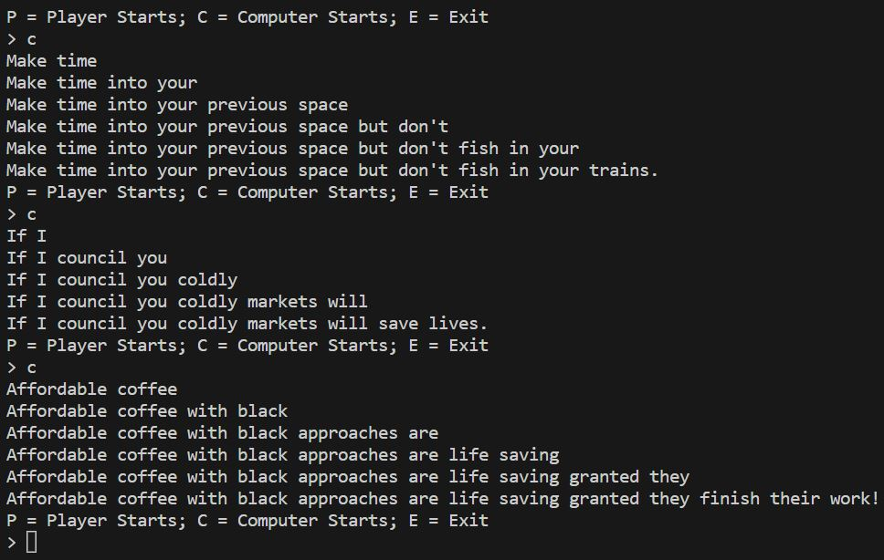

# X Word Story (WIP)

Inspired by the 10 Word Story game from Good Mythical Morning, this is a game where you can write stories word-by-word with the computer.\
It's not limited to 10 words, though, which is why it's called X Word Story. The story ends when you end the sentence.\
The React version of the game is not implemented yet. The terminal version is.

## Getting Started
`git clone https://github.com/bagelbomb/x-word-story.git`\
`npm install`

## Scripts

`npm start`\
Runs the app in development mode.\
Open [http://localhost:3000](http://localhost:3000) to view it in your browser.

`npm run play`\
Starts the terminal version of the game.\
Entering `p` will let you enter the first word.\
Entering `c` will have the computer enter the first word.\
End a story by finishing the sentence, with ".", "!", or "?"

`npm test`\
Runs the test suite.

`npm run build`\
Builds the app for production to the `build` folder.

## Examples
